<h1 style="text-align: center">cmall商城系统</h1>

#### 项目简介
CeaM Mall商城前端管理系统基于当前前沿的的三大框架之一Vue，组件库基于Elementui，前后端完全分离的开发模式。前端组件经过了封装，有统一的编程风格，组件化、模块化。系统整体技术有SpringBoot2+MybatisPlus+SpringSecurity+Jwt+Redis+Vue等。功能模块包括系统管理、会员管理、商城管理、秒杀、优惠券、积分、拼团、签到、抽奖等。搭建SpringCloud版本、SpringCloud Alibaba版本请看下面博客教程。适合企业或个人，可二次开发，商用需获取授权。

# uniapp小程序体验(面试题大放送，用微信扫描下方即可体验)

#### 面试题软考模拟考试、微信支付、智能CAI(具备在您的学习、工作、生活、情感等方面提供帮助的能力)等等


# 项目更新说明!!!
如果前端项目使用vue2，请使用1.0分支后端，另外数据库用户表字段做了变更(意思是说ceam_sys_user补充两个字段email类型为varchar，job_id类型为bigint)。如果前端项目使用的是Vue3，请使用1.5分支后端，数据库也是1.5。

# 基于vue2项目的演示

#### [求职招聘系统](https://www.bilibili.com/video/BV1vg4y1T7gY)

#### [学生管理系统](https://www.bilibili.com/video/BV1Uc411W7X5)


# 关注公众号获取更多惊喜


# 本地安装
## 基本环境（必备，登录过期，需要启动Redis!!!）
- 1、JDK：8+
- 2、Redis 3.0+
- 3、Maven 3.0+
- 4、MYSQL 5.7+
- 5、Node v10+

### 开发工具
Idea等

### 后台系统工程（JAVA端）

1、请确保redis已经安装启动

2、下载代码

```
https://gitee.com/CGFYHBK/boot-mall.git

```
3、导入项目
- 选择Idea左上角File，选择open


- 点击需要导入的项目，点击OK


- 选择New Window


4、项目结构如下：


5、导入数据库，配置开发环境数据库信息及其redis信息(没有redis的项目不需要配置)

5.1、配置文件放哪


5.2、账号密码配置自己的、账号密码配置自己的、账号密码配置自己的，重要事情说三遍。


6、运行
- 方式1


- 方式2


### 后台前端工程（VUE端）

1、请确保本地已经安装node,建议node12

2、下载代码

```
https://gitee.com/CGFYHBK/open-vue.git
```

3、npm install或者yarn install，当前所有命令必须当前工程目录下进行，目录结构如下：


建议安装依赖模板用cmd命令行进行安装，如果在Idea打开安装有时Idea会卡，不存在这种问题的当然最好在idea直接打开

4、安装依赖失败

可以看看我的CSDN博客，关于Vue的专栏

5、在控制台输入命令：npm run dev(有的项目用npm run serve)等，控制台打印出如下画面，恭喜表示本项目启动成功拉。


### 后台前端工程（VUE3端，node.js为14版本以上，建议16）

- 获取项目代码


```
git clone https://gitee.com/CGFYHBK/open-ceam-vue3
```


- 安装依赖


```
pnpm install
```


- 运行


```
pnpm serve
```


- 打包


```
pnpm build
```


# 项目说明

## 系统架构

凑合着看吧


## 商城功能
1. 商品模块：商品信息、商品分类、规格设置，商品上下架等
2. 订单模块：下单、购物车、支付，发货、收货、评价、退款等
3. 营销模块：积分、优惠券、拼团、秒杀、签到、抽奖等
4. 配置模块：字典配置、角色配置等各种配置
5. 用户模块：登陆、注册、会员卡、充值等
6. 其他等

### 项目结构

模块化

- ceam-admin 后台模块
- ceam-common 公共模块
- ceam-generator 代码生成模块
- ceam-jwt-core Token内核模块
- ceam-service-api DTO与VO等
- ceam-web 入口启动模块
- ceam-shop 商城模块
- ceam-wx 微信相关模块

### 系统界面

后台Web端：
|   |   |
|---|---|
|   |   |
|    |   |
|   |   |
|   |   |
|   |   |
| 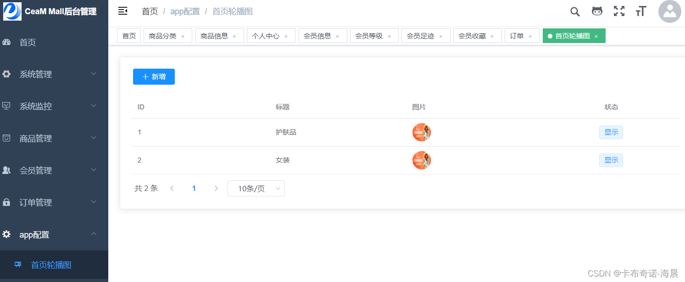  |   |
|   |   |


小程序端：


|   |   |
|---|---|
|   |   |
|   |   |


### 技术选型

后端使用技术：

- SpringBoot2
- mybatis、MyBatis-Plus
- SpringSecurity
- Druid
- Slf4j
- Fastjson
- JWT
- Redis
- Mysql
- WxJava
- Lombok
- Hutool

Vue3前端技术：

- node16 和 git -项目开发环境
- Vite - 熟悉 vite 特性
- Vue3 - 熟悉 Vue 基础语法
- TypeScript - 熟悉TypeScript基本语法
- Es6+ - 熟悉 es6 基本语法
- Vue-Router-Next - 熟悉 vue-router 基本使用
- Ant-Design-Vue - ui 基本使用
- Mock.js - mockjs 基本语法

vu2前端使用技术：

- Vue 全家桶
- Element
- 微信小程序

### 关于健身约课uniapp(有教程、非开源、需要关注公众号联系我)

|    | 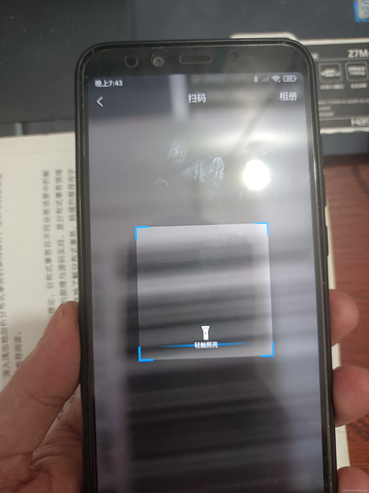  |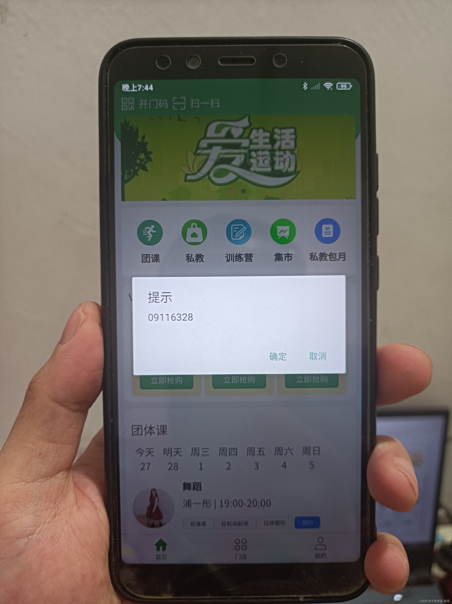  | 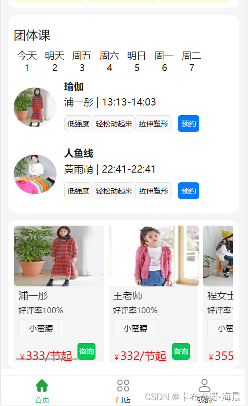  |
|---|---|---|---|
|    |    |   |   |
|   | 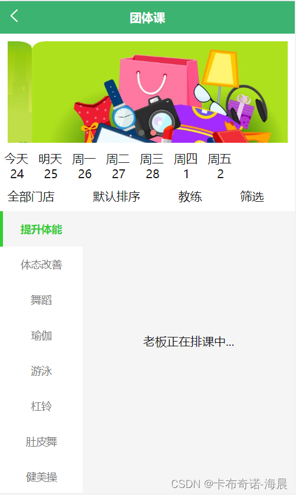  | 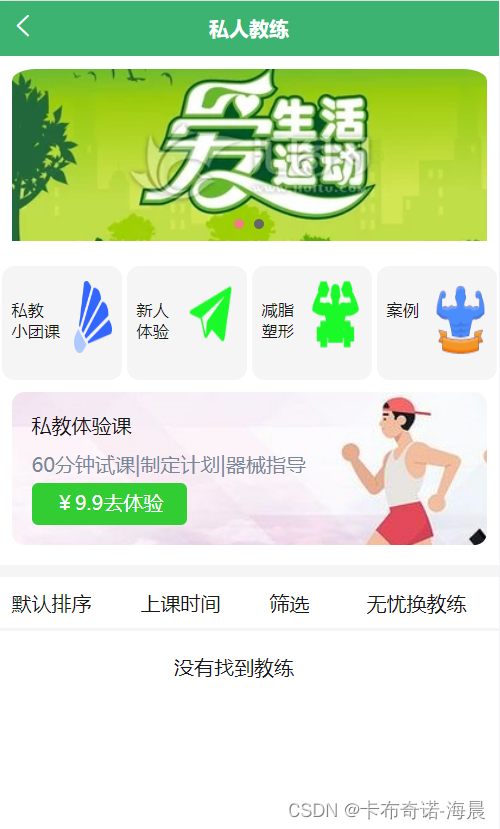  | 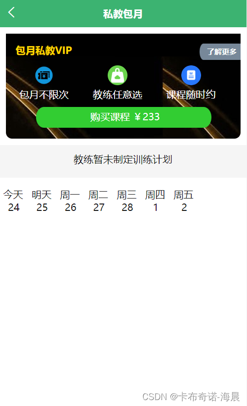  |
| 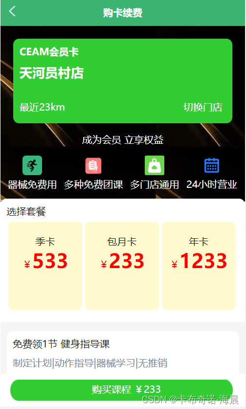  |   |   | 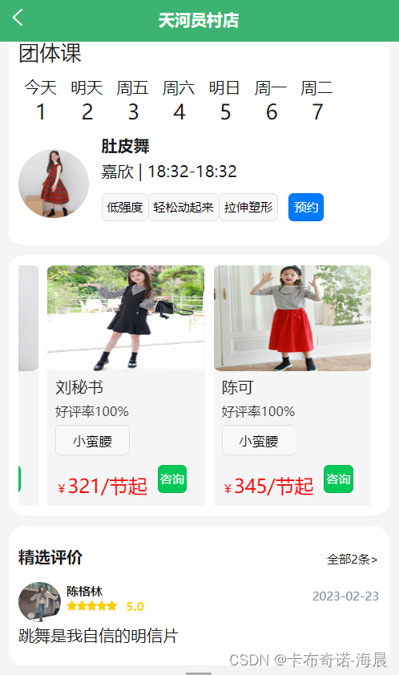  |
| 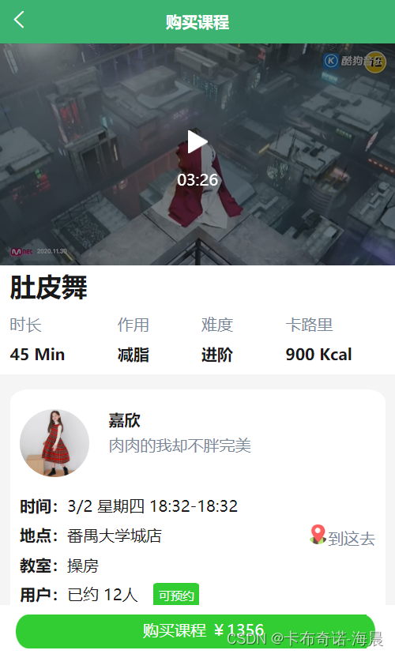  | 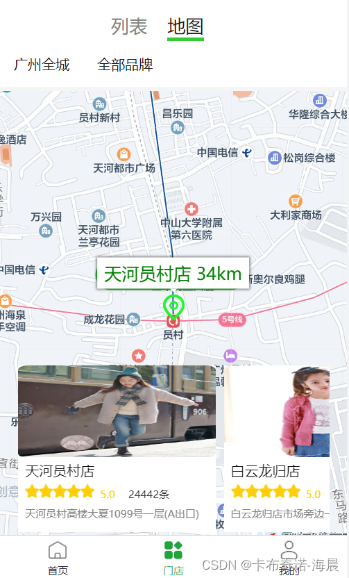  | 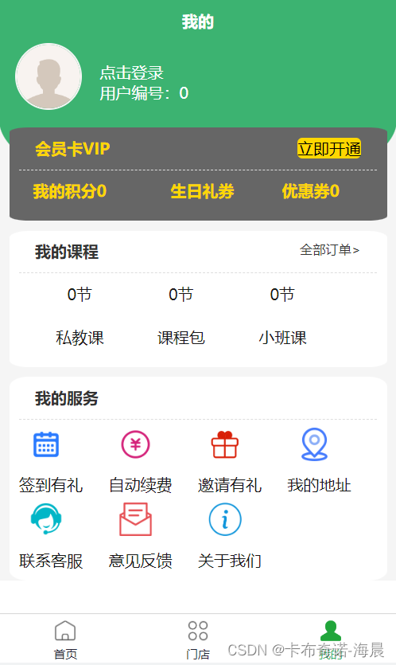  |   |
|   |   |  |   |

### 关于考试学习uniapp微信小程序(有教程、非开源、需要关注公众号联系我)

基于Uniapp + VUE3 + TypeScript等实现

|   |   |   |   |
|---|---|---|---|
|   |   |   |   |
|   |   |   |   |
|   |   |   |   |
|   |   |   |   |


# CSDN博客： **卡布奇诺-海晨** 

 **Spring、SpringBoot、SpringCloud、Nacos、RocketMQ、MyBatis等源码解读系列，系统架构封装、性能优化、持续集成开发与部署等，离不开对这些技术底层的理解。面试工作都可以助你一臂之力。** 
- [【Spring】一文带你吃透IOC容器技术](https://blog.csdn.net/qq_57756904/article/details/128352906?spm=1001.2014.3001.5502)
- [【微服务】SpringCloud中OpenFeign请求处理及负载均衡流程](https://blog.csdn.net/qq_57756904/article/details/128167388?spm=1001.2014.3001.5502)
- [【微服务】SpringCloud中Ribbon的WeightedResponseTimeRule策略](https://blog.csdn.net/qq_57756904/article/details/128123147)
- [【微服务】SpringCloud中Ribbon的轮询(RoundRobinRule)与重试(RetryRule)策略](https://blog.csdn.net/qq_57756904/article/details/128103221)
- [【微服务】SpringCloud中Ribbon集成Eureka实现负载均衡](https://blog.csdn.net/qq_57756904/article/details/127975696)
- [【微服务】SpringCloud轮询拉取注册表及服务发现源码解析](https://blog.csdn.net/qq_57756904/article/details/127932555)
- [【微服务】SpringCloud微服务续约源码解析](https://blog.csdn.net/qq_57756904/article/details/127932555)
- [【微服务】SpringCloud微服务注册源码解析](https://blog.csdn.net/qq_57756904/article/details/127885624)
- [【微服务】Nacos2.x服务发现？RPC调用？重试机制？](https://blog.csdn.net/qq_57756904/article/details/127784924?spm=1001.2014.3001.5502)
- [【微服务】Nacos通知客户端服务变更以及重试机制](https://blog.csdn.net/qq_57756904/article/details/127837782)
- [【微服务】Nacos服务发现源码分析](https://blog.csdn.net/qq_57756904/article/details/127804082)
- [【微服务】SpringBoot监听器机制以及在Nacos中的应用](https://blog.csdn.net/qq_57756904/article/details/127765982)
- [【微服务】Nacos服务端完成微服务注册以及健康检查流程](https://blog.csdn.net/qq_57756904/article/details/127731672)
- [【微服务】Nacos客户端微服务注册原理流程](https://blog.csdn.net/qq_57756904/article/details/127684157)
- [【微服务】SpringCloud中使用Ribbon实现负载均衡的原理](https://blog.csdn.net/qq_57756904/article/details/127648980)
- [【微服务】SpringBoot启动流程注册FeignClient](https://blog.csdn.net/qq_57756904/article/details/127606128)
- [【微服务】SpringBoot启动流程初始化OpenFeign的入口](https://blog.csdn.net/qq_57756904/article/details/127592093)
- [Spring Bean的生命周期](https://blog.csdn.net/qq_57756904/article/details/127565896)
- [Spring事务原理](https://blog.csdn.net/qq_57756904/article/details/127471224)
- [SpringBoot自动装配原理机制及过程](https://blog.csdn.net/qq_57756904/article/details/127380854)
- [SpringBoot获取处理器流程](https://blog.csdn.net/qq_57756904/article/details/127314905)
- [SpringBoot中处理器映射关系注册流程](https://blog.csdn.net/qq_57756904/article/details/127309834)
- [Spring5.x中Bean初始化流程](https://blog.csdn.net/qq_57756904/article/details/127210075)
- [Spring中Bean定义的注册流程](https://blog.csdn.net/qq_57756904/article/details/127190516)
- [Spring的处理器映射器与适配器的架构设计](https://blog.csdn.net/qq_57756904/article/details/126699242)
- [SpringMVC执行流程图解及源码](https://blog.csdn.net/qq_57756904/article/details/126686665)

 **# 微服务实战搭建系列** 
- [【微服务】SpringCloud的OpenFeign与Ribbon配置](https://blog.csdn.net/qq_57756904/article/details/127971775)
- [集Oauth2+Jwt实现单点登录](https://blog.csdn.net/qq_57756904/article/details/126438452)
- [Spring Cloud Alibaba微服务第29章之Rancher](https://blog.csdn.net/qq_57756904/article/details/126261112)
- [Spring Cloud Alibaba微服务第27章之Jenkins](https://blog.csdn.net/qq_57756904/article/details/125677671)
- [Spring Cloud Alibaba微服务第24章之Docker部署](https://blog.csdn.net/qq_57756904/article/details/125655393)
- [Spring Cloud Alibaba微服务第23章之Oauth2授权码模式](https://blog.csdn.net/qq_57756904/article/details/125653971)
- [Spring Cloud Alibaba微服务第22章之Oauth2](https://blog.csdn.net/qq_57756904/article/details/125594703)
- [Spring Cloud Alibaba微服务第21章之分布式事务](https://blog.csdn.net/qq_57756904/article/details/125573822)
- [Spring Cloud Alibaba微服务第18章之消息服务](https://blog.csdn.net/qq_57756904/article/details/125525215)
- [Spring Cloud Alibaba微服务第16章之服务容错](https://blog.csdn.net/qq_57756904/article/details/125493018)
- [Spring Cloud Alibaba微服务第14章之分库分表](https://blog.csdn.net/qq_57756904/article/details/125487678)
- [Spring Cloud Alibaba微服务第11章之MyBatis-plus](https://blog.csdn.net/qq_57756904/article/details/125483610)
- [Spring Cloud Alibaba微服务第8章之OpenFeign](https://blog.csdn.net/qq_57756904/article/details/125473940)
- [Spring Cloud Alibaba微服务第7章之负载均衡Ribbon](https://blog.csdn.net/qq_57756904/article/details/125468077)
- [https://blog.csdn.net/qq_57756904/article/details/125468077](https://blog.csdn.net/qq_57756904/article/details/125462909)
- [SpringCloud Alibaba微服务第4章之Nacos](https://blog.csdn.net/qq_57756904/article/details/125457559)
- [SpringCloud Alibaba微服务开篇](https://blog.csdn.net/qq_57756904/article/details/125397880)


### 反馈交流(请点击右上角的小星星star支持下)

喜欢这个商城后台的小伙伴留下你的小星星啦，star,star,star哦！更多惊喜等着你哦！！
